# Architecture Diagrams

Visual overview of New Gen Agent's architecture using Mermaid diagrams.

---

## 1. System Overview

High-level components and data flow:

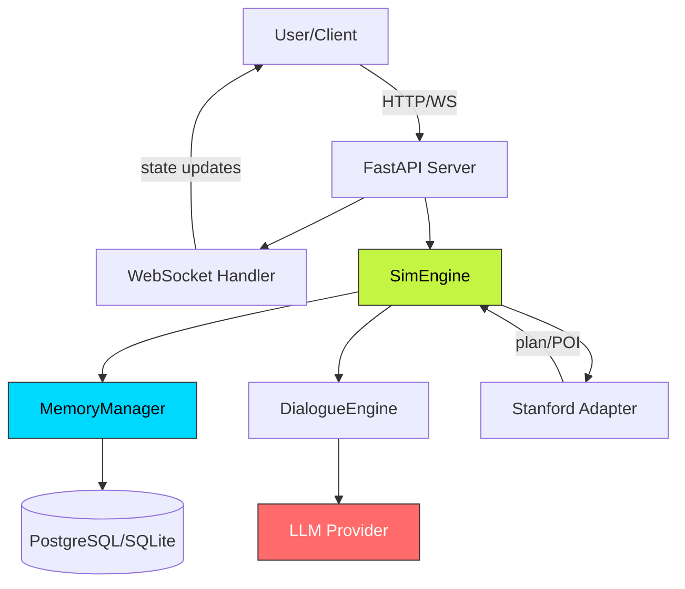

**Key components:**
- **FastAPI Server:** REST API + WebSocket for real-time updates
- **SimEngine:** Core tick-based simulation loop
- **MemoryManager:** Persistent agent memories with decay
- **DialogueEngine:** LLM-powered conversations
- **Stanford Adapter:** Integration with original Stanford codebase

---

## 2. SimEngine Tick Loop

What happens during a single `engine.advance()` call:

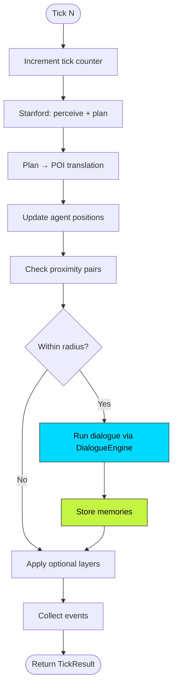

**Flow:**
1. Increment tick counter
2. Stanford: perceive environment, generate plan
3. Translate plan → POI (Plan-to-POI matching)
4. Update agent positions (move toward target POI)
5. Check proximity (find agents within `interaction_radius`)
6. Run dialogue if agents are close enough
7. Store memories for both agents
8. Apply optional layers (HRM, RLIF, SEAL, etc.)
9. Collect events and return `TickResult`

---

## 3. Memory System

How memories are stored, retrieved, and decayed:

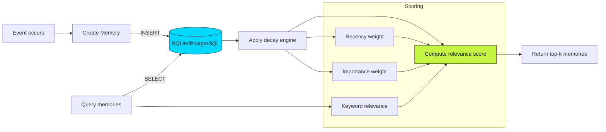

**Retrieval scoring formula:**

```
score = recency_weight * importance_weight * relevance_weight
```

- **Recency:** Exponential decay based on time since last access
- **Importance:** Agent-assigned salience (0.0–10.0)
- **Relevance:** Keyword overlap with query

---

## 4. Dialogue Flow

Agent-to-agent conversation generation:

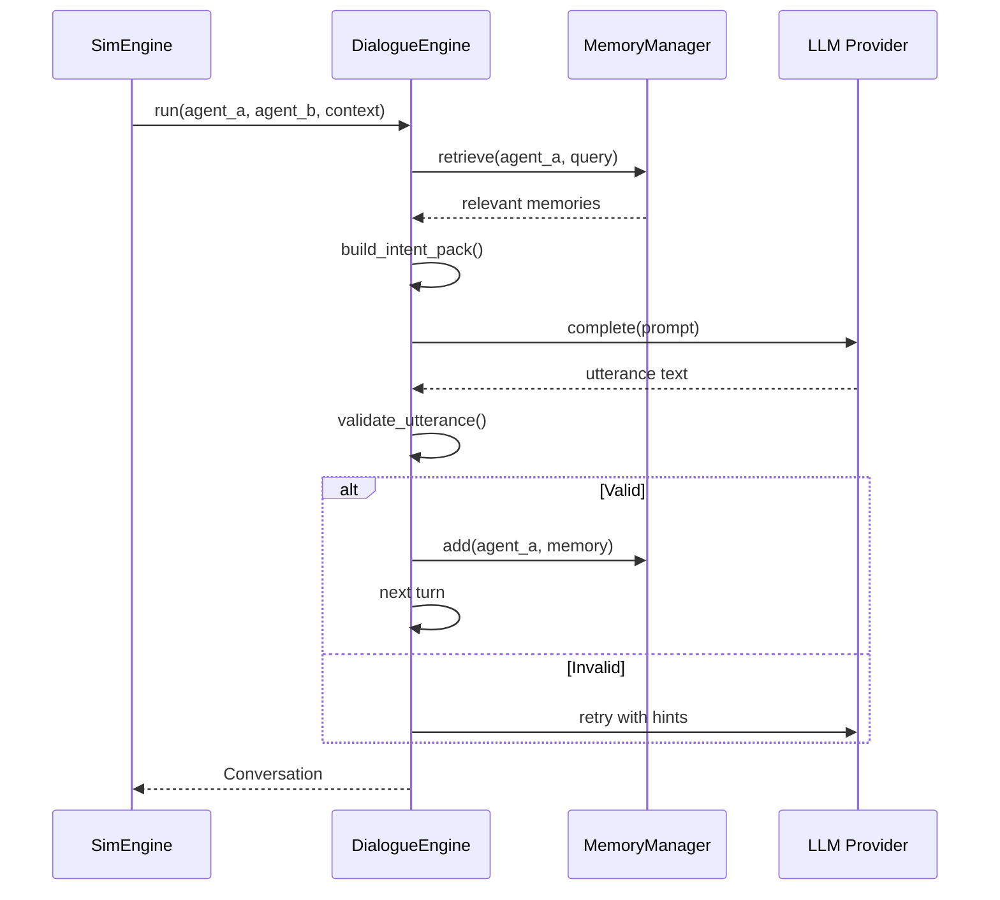

**Steps:**
1. Retrieve relevant memories for both agents
2. Build intent pack (goals, emotions, traits)
3. Generate prompt with scenario + memories + intent
4. LLM generates utterance
5. Validate (length, quality score, guards)
6. Store as memory
7. Repeat for N turns

---

## 5. Stanford Integration Boundary

How the new architecture interacts with vendored Stanford code:

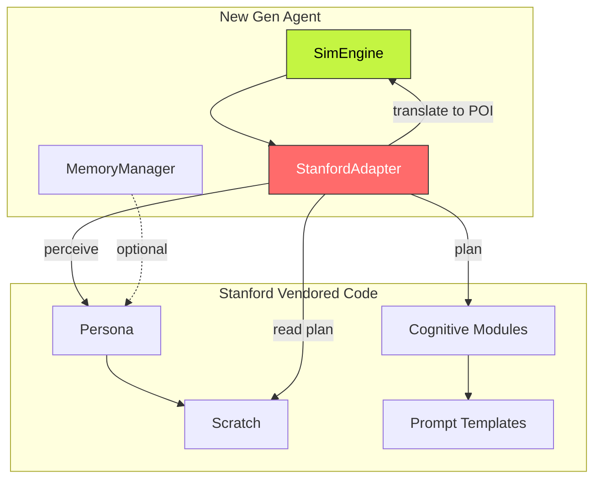

**Adapter responsibilities:**
- Wrap Stanford's `Persona` class
- Call `perceive()`, `plan()` methods
- Translate Stanford's textual plans → POI objects
- Isolate new codebase from Stanford internals

**Why vendored?**
- Stanford code is frozen (research artifact)
- No upstream changes expected
- Full control over modifications
- Simplifies testing and deployment

---

## 6. Optional Layers (Dependency Injection)

How optional layers are wired into `SimEngine`:

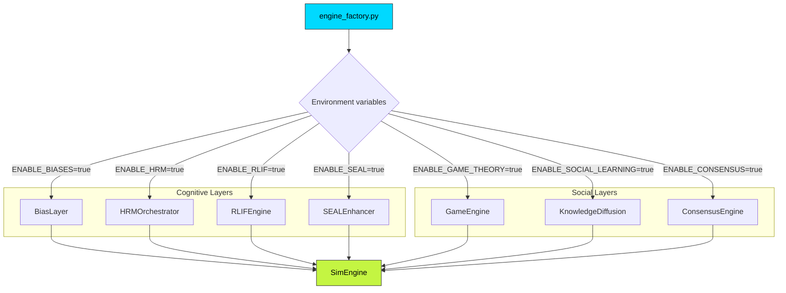

**Pattern:**
- All layers are **optional** (disabled by default)
- Enabled via environment variables (`ENABLE_*=true`)
- Injected into `SimEngine` constructor
- If `None`, layer is skipped (no performance cost)

---

## 7. LLM Provider Stack

Circuit breaker + provider abstraction:

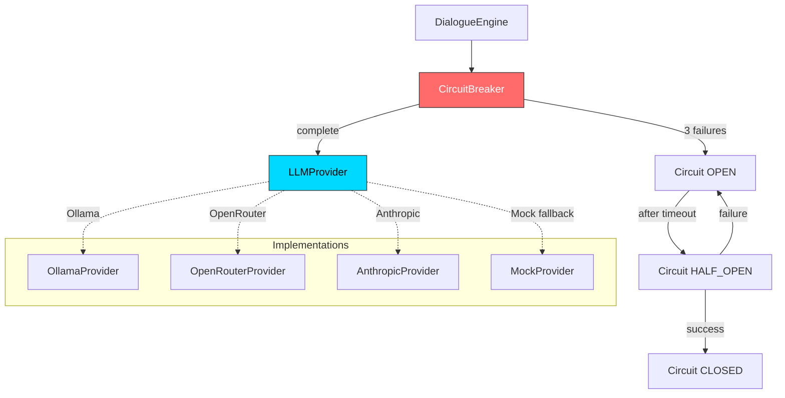

**Circuit breaker states:**
- **CLOSED:** Normal operation (calls pass through)
- **OPEN:** LLM unavailable (fail fast, return error)
- **HALF_OPEN:** Testing recovery (allow 1 call)

**Benefits:**
- Prevents cascade failures
- Graceful degradation (fall back to mock)
- Automatic recovery after timeout

---

## 8. Database Schema

Core tables and relationships:

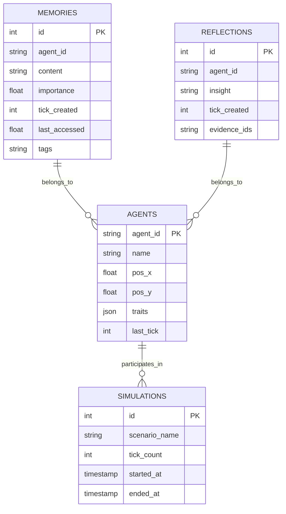

**Tables:**
- **memories:** Per-agent event/observation storage
- **reflections:** LLM-generated insights (higher-order memories)
- **agents:** Agent state (position, traits, last tick)
- **simulations:** Metadata for simulation runs

**Migrations:** Managed by Alembic (`migrations/versions/`)

---

## 9. WebSocket Real-time Updates

Server-to-client message flow:

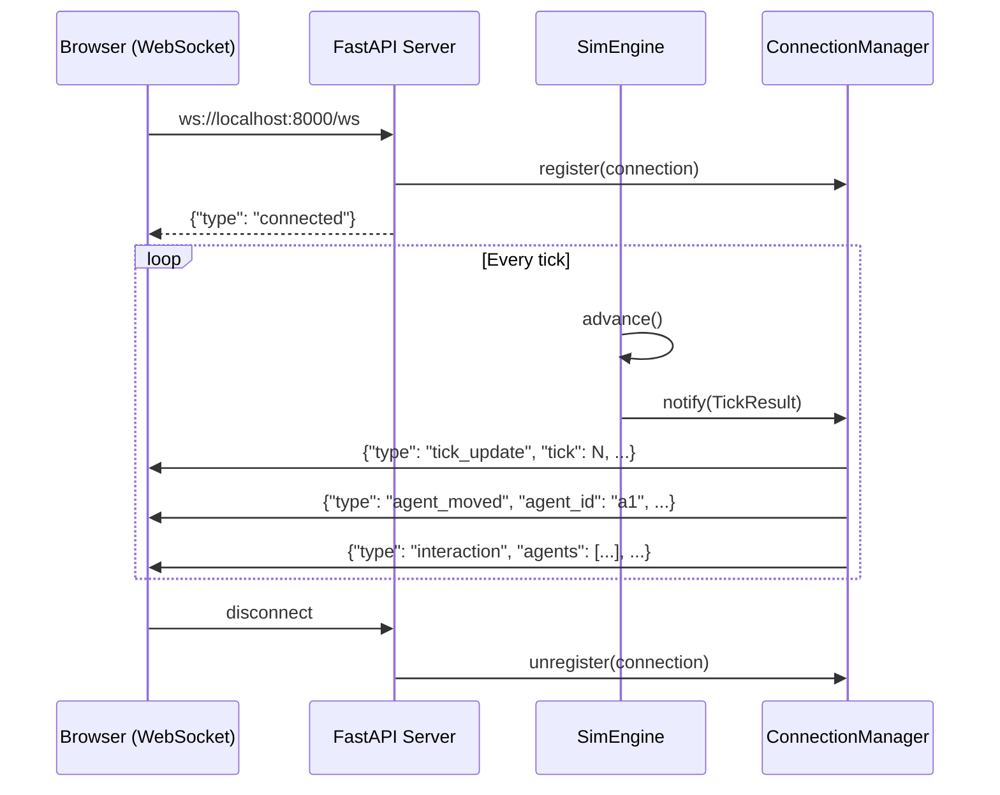

**Message types:**
- `connected`: Initial handshake
- `tick_update`: New tick + global stats
- `agent_moved`: Agent position update
- `interaction`: Agents met and interacted
- `dialogue`: Conversation utterances
- `error`: Simulation error or warning

**Protocol:** See [`docs/guides/WEBSOCKET_PROTOCOL.md`](../guides/WEBSOCKET_PROTOCOL.md)

---

## 10. CI/CD Pipeline

GitHub Actions workflow:

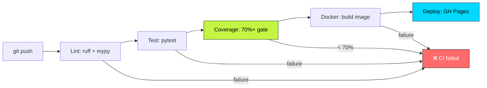

**Jobs:**
1. **Lint:** `ruff` (E, F, I, UP rules) + `mypy --strict`
2. **Test:** `pytest` on Python 3.10 + 3.11
3. **Coverage:** Enforce 70%+ on `gen_agent/`
4. **Postgres:** Integration tests with PostgreSQL service
5. **Smoke:** Run `hello_world.py` + 10-tick mock sim
6. **Docker:** Build multi-stage image + health check
7. **Pages:** Deploy Astro site to GitHub Pages

**Triggers:** Push to `main`/`develop`, pull requests

---

## Color Legend

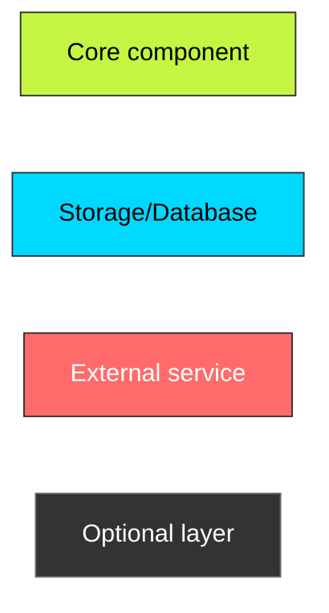

---

## See also

- [OVERVIEW.md](OVERVIEW.md) — Textual architecture description
- [MODULARITY.md](MODULARITY.md) — Protocol-based design patterns
- [UPSTREAM_RELATIONSHIP.md](UPSTREAM_RELATIONSHIP.md) — Stanford fork details
- [../guides/WEB_UI.md](../guides/WEB_UI.md) — WebSocket API details
- [../database/SCHEMA.md](../database/SCHEMA.md) — Full database schema
